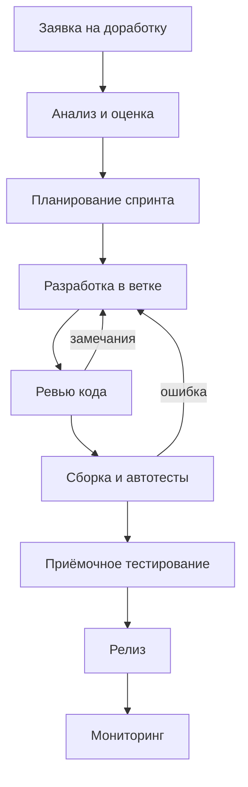

# Определение продукта

> **СпринтЛаб – от задачи до релиза без потерь и задержек.**

## Краткое описание

**Проблема.** В небольших и средних командах разработки процесс «размазан» по нескольким несвязанным инструментам: задачи живут в таблицах и мессенджерах, код – в Git, сборки – в отдельной CI-системе, а договорённости о релизе – в переписке. Руководитель не видит, на каком этапе застряла задача, ревью кода ждёт по несколько дней, а ошибки находят уже после выпуска. В результате изменения доходят до пользователей медленно и непредсказуемо.

**Пользователи.** Команды разработки из 5–50 человек в продуктовых компаниях и студиях заказной разработки: руководитель проекта и владелец продукта, разработчики, тестировщики, DevOps-инженеры, а также заказчики, которые хотят видеть ход работ.

**Особенности решения.**

- **Сквозной процесс в одном окне** – бэклог, спринт, ветка Git, ревью, сборка, тесты и релиз связаны с одной карточкой задачи.
- **Автоматические переходы** – статус задачи меняется сам по событиям Git и CI (открыт pull request, сборка прошла, релиз выпущен).
- **Контроль узких мест** – платформа подсвечивает задачи, которые дольше нормы ждут ревью или тестирования.
- **Встроенная аналитика DORA** – время выполнения изменений, частота развёртываний, доля неудачных изменений и время восстановления считаются без ручного ввода.
- **Портал заказчика** – заказчик видит статус своих задач и дату ближайшего релиза без доступа к коду.

## Процесс, который поддерживает продукт

