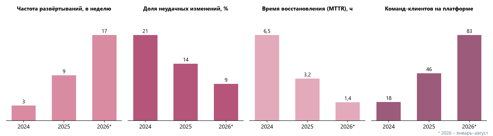

# Дополнительные метрики

Вспомогательные показатели дополняют главный KPI и помогают понять, за счёт чего он меняется.

| Показатель | 2024 | 2025 | 2026 (янв.–авг.) | Смысл |
|---|---|---|---|---|
| Частота развёртываний, в неделю | 3 | 9 | 17 | как часто команды выпускают изменения |
| Доля неудачных изменений (CFR), % | 21 | 14 | 9 | сколько релизов потребовали отката или исправления |
| Время восстановления (MTTR), ч | 6,5 | 3,2 | 1,4 | как быстро устраняется сбой в продуктиве |
| Команд-клиентов на платформе | 18 | 46 | 83 | рост пользовательской базы |
| Среднее время ожидания ревью, ч | 31 | 14 | 6 | узкое место процесса до v2.5 |
