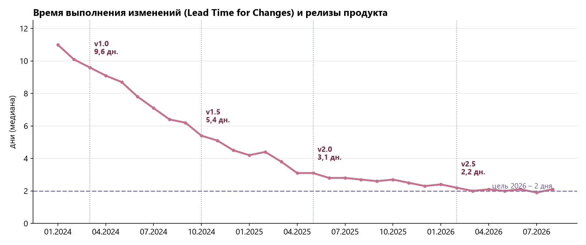

# Состояние продукта

## Главный KPI – время выполнения изменений

**Lead Time for Changes** – медиана времени от первого коммита по задаче до выхода изменения в продуктив у команд-клиентов. Это ключевая метрика DORA: чем она меньше, тем быстрее идея превращается в работающую функцию для пользователя. По этому показателю команда СпринтЛаб получает квартальную премию.

**Как считается:** для каждой задачи, выпущенной за месяц, берётся разница между временем первого коммита в её ветке и временем развёртывания релиза, в который она вошла; по всем задачам месяца считается медиана.

| Релиз | Дата | Lead Time, дни | Что повлияло |
|---|---|---|---|
| v1.0 | март 2024 | 9,6 | единая карточка задачи, связь с Git |
| v1.5 | октябрь 2024 | 5,4 | автопереходы статусов по событиям CI, напоминания о ревью |
| v2.0 | май 2025 | 3,1 | параллельные автотесты, шаблоны пайплайнов |
| v2.5 | февраль 2026 | 2,2 | подсветка узких мест, релизы по кнопке |

!!! info "Цель на 2026 год"
    Снизить Lead Time до **2 дней** и удержать долю неудачных изменений ниже 10 %.

Остальные показатели вынесены на вложенную страницу [«Дополнительные метрики»](metrics.md).
