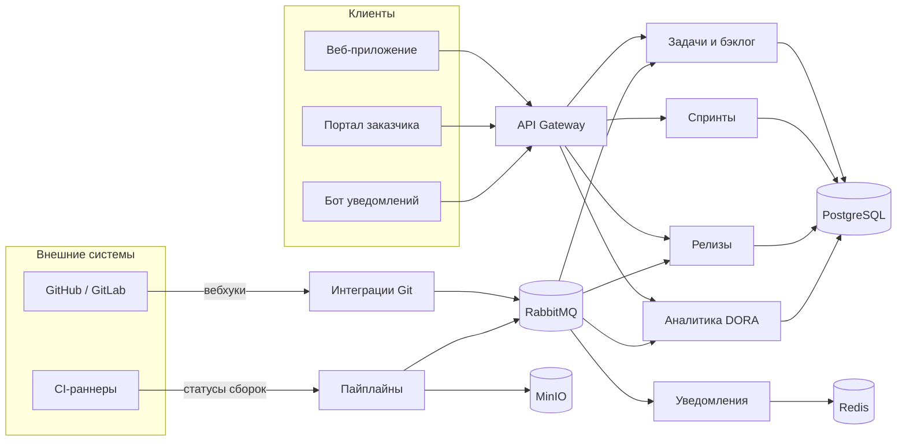

# Архитектура продукта

СпринтЛаб построен из независимых сервисов за общим API-шлюзом. Сервисы обмениваются событиями через шину сообщений, поэтому событие Git (например, открытие pull request) автоматически меняет статус задачи и попадает в аналитику.

## Архитектурные решения (ADR)

| № | Решение | Причина |
|---|---|---|
| ADR-1 | сервисная архитектура с API Gateway | независимые релизы сервисов, масштабирование интеграций |
| ADR-2 | событийное взаимодействие через RabbitMQ | статусы задач меняются по событиям Git и CI без опроса |
| ADR-3 | одна база PostgreSQL со схемами по сервисам | транзакционность и простота сопровождения на старте |
| ADR-4 | аналитика считается из журнала событий | метрики DORA без ручного ввода |
