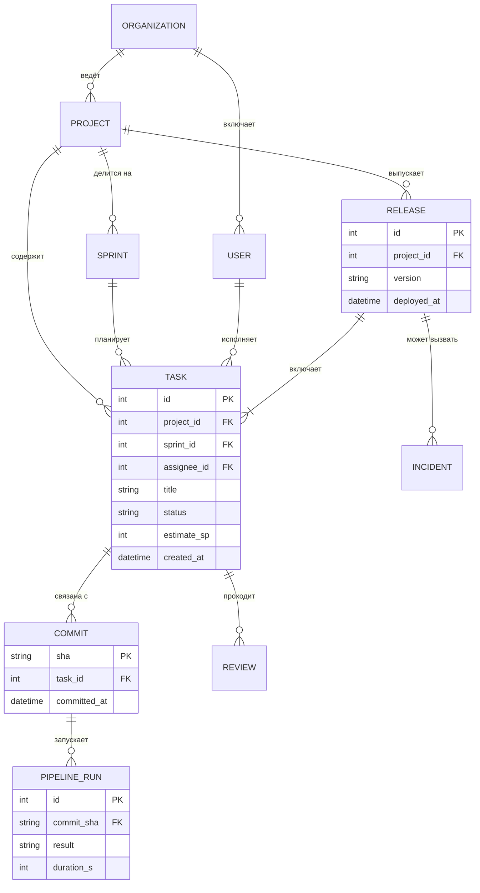

# Схема базы данных

| Сущность | Описание |
|---|---|
| Организация, Пользователь | компания-клиент и её сотрудники с ролями |
| Проект, Спринт | единица работы команды и её итерации |
| Задача | карточка изменения; статус меняется по событиям |
| Коммит, Ревью | связь задачи с кодом и проверкой кода |
| Запуск пайплайна | результат сборки и автотестов |
| Релиз, Инцидент | выпуск в продуктив и возможные сбои после него |
